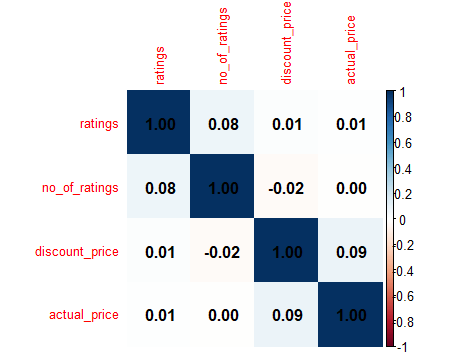
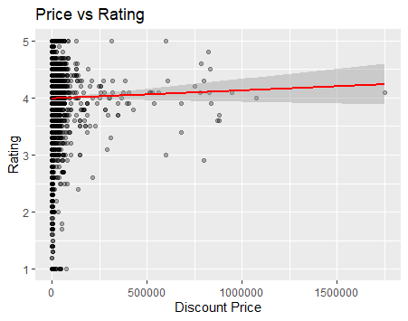

# Amazon Products Price vs Rating Analysis

Analyzed 20,000 Amazon products to find relationship between product price and customer ratings using R.

**Tools**: R, RStudio, dplyr, stringr, ggplot2, corrplot

**Key Steps:**
1. Data Cleaning: Removed ₹ symbols and commas from price columns  
2. Data Transformation: Converted text to numeric
3. Correlation Analysis: Used cor() function
4. Visualization: Correlation heatmap + Scatter plot

**Key Finding:**
Correlation between price and rating = 0.01  
**Conclusion**: No significant relationship between price and product ratings

**Visualizations:**

